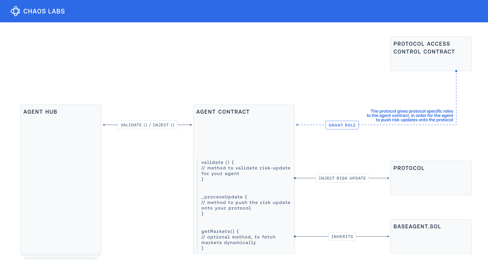
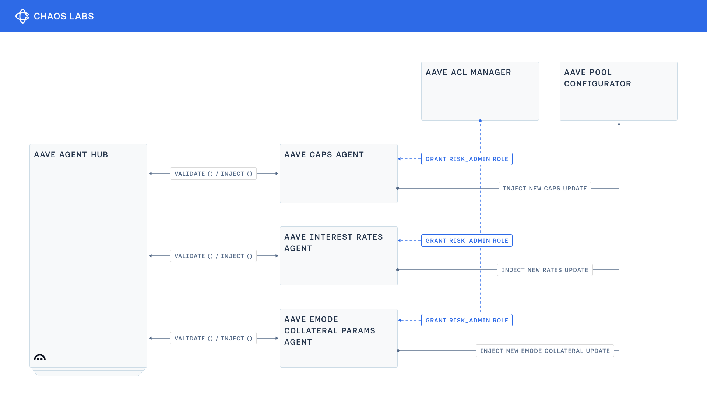

# Chaos Agents Factory

## Table of Contents

- [System Architecture](#system-architecture)
- [Key Components](#key-components)
- [Risk Parameters Update Flow](#risk-parameters-update-flow)
- [Repository Structure](#repository-structure)
- [Usage](#usage)
  - [Prerequisites](#prerequisites)
  - [Step 1: Set Up Agent Development Environment](#step-1-set-up-agent-development-environment)
  - [Step 2: Develop Your Agent Contract](#step-2-develop-your-agent-contract)
  - [Step 3: Test Your Agent](#step-3-test-your-agent)
  - [Step 4: Deploy and Register Your Agent](#step-4-deploy-and-register-your-agent)
- [License](#license)

[**Chaos Agents**](https://github.com/ChaosLabsInc/chaos-agents) is a middleware system between [**Chaos Risk Oracles**](https://oracles.chaoslabs.xyz/) and protocols consuming them, fully controlled by the protocol itself.
Each protocol has multiple Agents, each addressing a different type of risk update.

## System Architecture




_Example of Agents configuration, in this case for the Aave protocol_

## Key Components

See the [full documentation](https://github.com/ChaosLabsInc/chaos-agents) for the detailed description of the system components.

**Agents Hub**: The Agents Hub serves as the controller for multiple agents; a single monolith smart contract per protocol that is fully controlled by the protocol itself. It encompasses all common logic, including querying from [Chaos Risk Oracles](https://oracles.chaoslabs.xyz/), access control checks, generic validation, circuit breakers management, and more.

_Protocols should deploy and configure their own Hub from the main [repository](https://github.com/ChaosLabsInc/chaos-agents), as this one is exclusively for development and configuration of individual agents._

**Base Agent**: Base contract that provides common agent functionality. Your agent contracts inherit from the Base Agent and implement protocol-specific methods.

**Agents**: Independent contracts containing all protocol-specific logic. Each agent corresponds to only one updateType from a Chaos Risk Oracle and multiple markets (e.g., one agent for supplyCapUpdate for multiple assets on Aave, another agent for an interest rate parameter, etc).

Key Agent characteristics:

- **One agent = one updateType**: each agent handles only one type of update for multiple markets
- **Lightweight**: agents are small, trying to fulfill one single task and nothing else
- **Standard interface**: all agents implement common methods `validate()`, `inject()`, `getMarkets()`

## Risk Parameters Update Flow

When an update is available from the Chaos Risk Oracle:

1. The Agent Hub routes the update to the Agent matching its updateType
2. The Agent Hub does generic validations on the update like:
   - validating expiration window and minimumDelay of the update
   - validating that the update has not already been executed
   - agent enabled/permissioned sender checks
   - validating market selection based on configured `allowedMarkets` or agent `getMarkets()`
3. The Agent Hub calls the Agent's `validate()` method to perform protocol-specific validation
4. If validation passes, the Agent Hub calls the Agent's `inject()` method to update the protocol
5. The Agent directly interacts with the target protocol to apply the changes

Agent Hub optionally calls agent's `getMarkets()` to get dynamic markets (if enabled).

## Repository Structure

The repository contains:

- [ExampleAgent.sol](./src/contracts/agent/ExampleAgent.sol) — **example agent** with detailed inline comments explaining implementation
- [ExampleAgentTest.t.sol](./tests/agent/ExampleAgentTest.t.sol) — basic **test** setup for agent contract testing
- [ExampleAgentSetup.s.sol](./scripts/ExampleAgentSetup.s.sol) — deployment **scripts** to bootstrap your protocol specific agent contracts

## Usage

This section walks through the complete process of integrating Chaos Agents into your protocol.

### Prerequisites

- **Installed [Foundry](https://getfoundry.sh)**. See the [Foundry book](https://getfoundry.sh/introduction/installation) for installation instructions. The template ships with sensible defaults so you can use default `foundry` commands without resorting to a `Makefile`.
- **Deployed AgentHub contract** from the main [chaos-agents](https://github.com/ChaosLabsInc/chaos-agents) repository.
- **Chaos Risk Oracle address** from Chaos Labs, or knowledge of how your protocol-specific update will be structured on the Oracle.

### Step 1: Set Up Agent Development Environment

Create your agent development project from this template:

```sh
forge init --template ChaosLabsInc/chaos-agents-template my_new_project
cd my_new_project
cp .env.example .env
```

### Step 2: Develop Your Agent Contract

1. Copy the example agent as a starting point:

```sh
cp src/contracts/agent/ExampleAgent.sol src/contracts/agent/MyProtocolCapAgent.sol
```

2. Implement protocol-specific logic:

- Modify the `validate()` method to check protocol-specific constraints
- Implement the `inject()` method to call your protocol's parameter update functions
- Configure the `getMarkets()` method if you need dynamic market selection

3. Use common modules (optional):

- Import and use validation modules like RangeValidationModule for common checks. This reduces code duplication and maintains consistency

> **Note:** For a comprehensive guide on configuring your agent contract, see the [Configuration Guide](https://github.com/ChaosLabsInc/chaos-agents/blob/main/docs/ConfigurationGuide.md#setup-agent-contract).

### Step 3: Test Your Agent

1. Set up tests using the example as a template:

```sh
cp tests/agent/ExampleAgentTest.t.sol tests/agent/MyProtocolCapAgentTest.t.sol
```

2. Write comprehensive tests covering:

- Valid update scenarios and injection on the protocol
- Boundary conditions and fuzz testing for all possible inputs
- Invalid updates that should be rejected
- Integration with your protocol's mock contracts

3. Run your tests:

```sh
forge test
```

### Step 4: Deploy and register Your Agent

1. Copy the example deploy script:

```sh
cp scripts/ExampleAgentSetup.s.sol scripts/MyProtocolCapAgent.s.sol
```

2. Configure deployment script:

- Update the script with your agent contract and the configurations you wish to use.
- Make sure the Agent Hub is already deployed and setup.
- If using the RangeValidationModule, make sure to configure the range for your agent on the script.
- Register your agent on the Agent Hub, the agent registration on the Agent Hub can only be done by the owner, so make sure you have the necessary permissions.

## License

[MIT](./LICENSE), Copyright © 2025, Chaos Labs.
