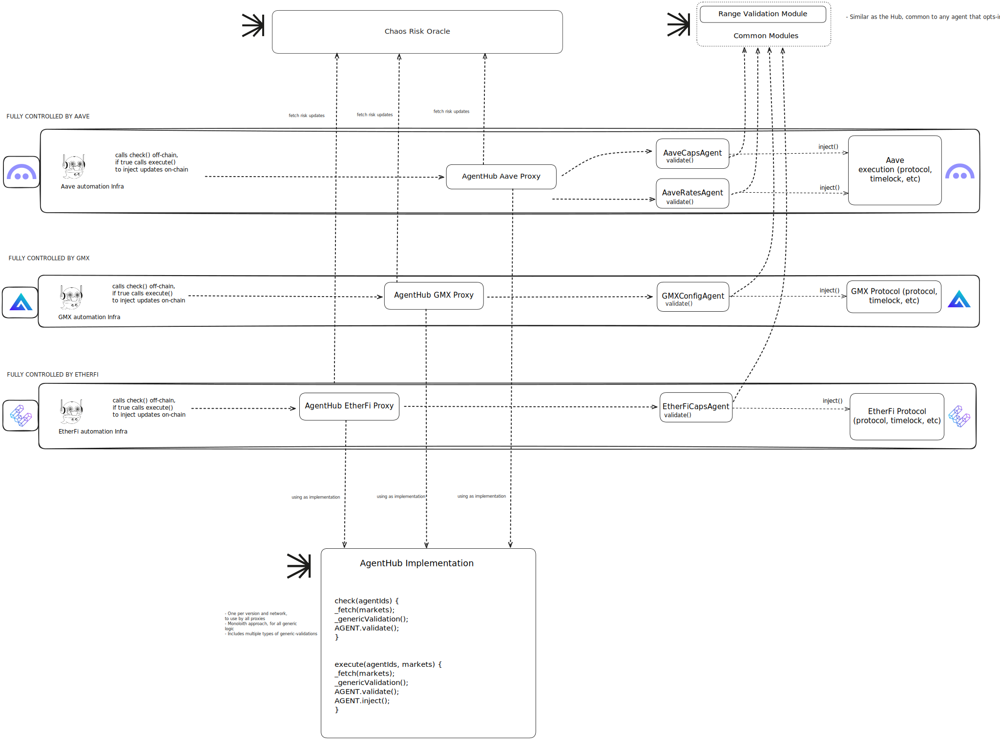
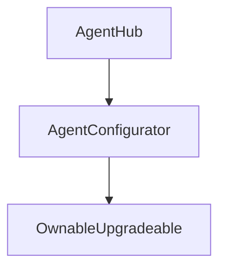

# Chaos Agents

The ChaosAgent system is a middleware between RiskOracle and the protocol where the update from RiskOracle needs to be injected.

[](https://bgd-labs.github.io/chaos-agents/)

## Architecture



## Chaos Agent Key Components:

### [AgentHub](src/contracts/AgentHub.sol):

The AgentHub acts as an orchestrator for multiple agents and is a single big monolith contract that holds all the common logic:

- Querying from RiskOracle
- Access Control Checks
- GenericValidation
  - Circuit Breakers, if disabled or not.
  - Validating if update expired or not.
  - Validating if update already executed.
  - Validating if minimum delay has passed since last executed.

*Note: For agentValidation (validation specific to the protocol) and injection, the AgentHub does an external call to the configured agent contract.*

The AgentHub also holds all the configurations for the agent with access control for the agent admin to update configs.

The AgentHub is a hub for multiple agents which can have different configurations specific to a protocol. Ex. one agent for doing supplyCapUpdate, another agent for doing slopeOneUpdate and so on.

The AgentHub has 2 main methods: `check()` and `execute()` which can be used to support both push and pull base architecture.
The `check()` method is called to check if for an agent update can be injected, and the `execute()` method is to be called to inject / push the update from the ChaosRiskOracle into the protocol.

#### Inheritance Structure

The diagram below illustrates the inheritance and dependency relationships of the AgentHub:



### [Agents](src/contracts/agent):

Agents are independent contracts that contain all the logic specific to the protocol.

An Agent corresponds to only one `updateType` from the ChaosRiskOracle and multiple markets, this is to ensure the agent contains logic only for the specific updateType ex. a single agent contract for `supplyCap` update across all listed assets on Aave.

Agents follow a common interface having these two main methods: `validate()` and `inject()` which are to be called by the AgentHub for doing specific validation to the agent for ex. RangeValidation for interest rate changes and so on and injection on the protocol.

Agents also have a `getMarkets()` method to use markets which are dynamic in nature, for markets which is not easy to configure directly on the AgentHub.

Agents are designed to be light-weight contracts as they will be deployed quite often and will contain only specific logic for the update.

### [Common Modules](src/contracts/modules):

The common modules are contracts that will be deployed once and used by multiple agents across hubs. Some examples of common modules will be:

- **[RangeValidationModule](src/contracts/modules/RangeValidationModule.sol)**: Independent immutable contract which contains logic to validate range and also holds range configurations with access contract for different hubs and agents. The range validation module can be used inside your `validate()` method on your agent contract to validate param ranges, the configuration can be set on the range validation module directly for your agent.
Please note: you can specify both default range configuration which will be common to all markets, and also configuration specific to a market. In case the configuration does not exists for a specific market the module will fallback to use the default configuration for all the markets.

Once you have registered your agent on the AgentHub, you can call `setRangeConfigByMarket()` and `setDefaultRangeConfig()` method to set range configuration for your agent.

## Access Control

The AgentHub system implements a hierarchical permissions model to ensure secure and controlled access to different functionalities:

### Primary Actors

<details>
<summary><strong>AgentHub Owner</strong></summary>

- **Role**: The highest privileged entity in the system with complete administrative control over an AgentHub instance.
- **Capabilities**:
  - Register new agents
  - Transfer ownership
  - Set global configurations (e.g., maxBatchSize)
  - Assign Agent Admins
  - Update agent contract addresses
  - Perform all actions available to Agent Admins
  - Set range configs for all agents belonging to the hub on RangeValidationModule contract
- **Trust Assumptions**:
  - Complete trust required - has system-wide control and can modify any aspect of the hub configuration
  - Can potentially disrupt the entire system by registering malicious agents or modifying critical parameters
  - Expected to be a trusted multi-sig or governance of the protocol
</details>

<details>
<summary><strong>ProxyAdmin Owner</strong></summary>

- **Role**: Entity with the power to upgrade the AgentHub contract implementation.
- **Capabilities**:
  - Upgrade the AgentHub proxy to point to any implementation
  - Change the entire logic of the system through upgrades
  - Transfer ProxyAdmin ownership
- **Trust Assumptions**:
  - Maximum trust required - can completely replace system logic
  - If compromised, the entire system can be compromised regardless of other security measures
  - Ideally should be the same entity as the AgentHub Owner or have equivalent security
</details>

<details>
<summary><strong>Agent Admin</strong></summary>

- **Role**: Administrator with control over specific agent configurations but not the entire hub.
- **Capabilities**:
  - Enable/disable agents
  - Manage permissioned senders list
  - Configure allowed/restricted markets
  - Set expiration periods and minimum delays
  - Configure agent contexts
  - Set range configs for only the agent it is admin for on RangeValidationModule contract
- **Trust Assumptions**:
  - Significant trust required for their specific agents
  - Cannot register new agents or modify global hub settings
</details>

<details>
<summary><strong>Permissioned Senders</strong></summary>

- **Role**: Entities authorized to trigger updates for specific agents.
- **Capabilities**:
  - Call `execute()` for agents they're specifically permissioned for
  - No administrative capabilities
- **Trust Assumptions**:
  - Limited trust required - cannot modify system configurations
  - Can only trigger updates that have passed validation
  - May be automated services, bots, or keepers
</details>

### Secondary Actors

<details>
<summary><strong>ChaosRiskOracle (Chaos Labs)</strong></summary>

- **Role**: External data provider that supplies risk parameter updates.
- **Capabilities**:
  - Produce risk parameter updates of various types
- **Trust Assumptions**:
  - Significant trust required as the source of risk parameters.
  - To minimise the trust given of ChaosRiskOracle, we have strict validation on the agent side with range validation, minimum delays and so on.
  - Expected to provide accurate, timely, and well-considered risk updates
  - Incorrect data could potentially impact protocol risk params
</details>

<details>
<summary><strong>Agent Contract Deployers/Developers</strong></summary>

- **Role**: Responsible for creating and deploying the agent-specific logic.
- **Capabilities**:
  - Implement custom validation and injection logic
  - Define protocol-specific checks
- **Trust Assumptions**:
  - High trust required - designs critical protocol interaction logic
  - Errors in implementation could lead to system vulnerabilities
  - Expected to be the protocol's core development team or trusted contractors
</details>

<details>
<summary><strong>Target Protocol</strong></summary>

- **Role**: The protocol receiving the risk parameter updates.
- **Capabilities**:
  - Implement access control for parameter updates
  - Enforce protocol-specific logic on parameter changes
- **Trust Assumptions**:
  - Must grant appropriate permissions to agent contracts
  - Must have proper access control on its end when invoked by the agent contract
</details>

<details>
<summary><strong>Public Users (when isAgentPermissioned: false)</strong></summary>

- **Role**: Anyone who can trigger permissionless updates.
- **Capabilities**:
  - Call `execute()` for non-permissioned agents
  - No administrative capabilities
- **Trust Assumptions**:
  - No trust required - cannot bypass system validations
  - Can only trigger updates that would pass all validation checks
  - May include keepers, automated services, or protocol users
</details>

### [Threat Modeling](docs/ThreatModeling.md)

### Key Access Control Points

- **Agent Registration**: Only the hub owner can register new agents via `registerAgent()` with the `onlyOwner` modifier
- **Agent Configuration**: Only the agent admin and hub owner can modify agent settings through the `onlyOwnerOrAgentAdmin` modifier
- **Update Execution**: Controlled by the `isAgentPermissioned` flag and permissioned senders list, checked during `execute()`
- **Protocol Interaction**: Permissions for protocol updates are granted to the agent contract i.e `agentAddress`, not the hub

### [Configuration and Deployment Guide](docs/ConfigurationGuide.md)

### FAQ's:

**Case of existing setup in production**

1. I have a Hub and multiple agents configured in production, but I'm upgrading my protocol and need to adapt the logic of how my Hub and     Agents interact with it. What do I need to do?

    New agent contracts with the latest protocol changes needs to be deployed first. Once we have the new agent contracts, the protocol specific roles given to old agent contracts should be revoked and the roles given to the new agent contract. The hub owner should now change the agentContract using the `setAgentAddress()` setter for all the agents.

2. There is a new version of the Hub that I would like to upgrade to, what implications it have/what do I need to do considering that I have multiple agents in production?

    Considering the latest version of Hub has no breaking changes, the latest version of the Hub implementation needs to be deployed, and using the ProxyAdmin of the Hub proxy, the new implementation of Hub should be set.

3. There is a new general module that I would like to plug to my agents, what should I do?

    If you store the module address as immutables on the agent contract you would need to redeploy the agent and set the new agent address using the `setAgentAddress()`
    However, if you store the address of the module in AgentContext as bytes, you would need to update the AgentContext with the new bytes encoded module address and set it using `setAgentContext()` setter without any redeployment of agent contract.

**Misc**

1. I have want to have an agent with multiple updateTypes, what can I do?

  Each agent on the AgentHub corresponds to only one updateType and multiple markets of the ChaosRiskOracle. If you wish to have multiple updateTypes, you can register multiple agents on the hub. Please note: you can re-use the agentContract across multiple agents by doing some abstraction on the agentContract.

2. What happens if we have multiple updates on the RiskOracle and a lot of them or all are over the expiration period? Can it block the system? If so, how to unblock the system by the admin?

    If the updates from the RiskOracle is expired and blocked, the agent admin can increase the expiration period to unblock the updates using the `setExpirationPeriod()` setter.

3. How is the configuration flow of ranges configs? E.g. in an "open-market" system where the list of all markets on an agent is dynamically changing.

    On the RangeValidationModule, we configure the range configs for all default markets using the `setDefaultRangeConfig()` setter. This range config will be used for all markets unless overridden. For only a specific market if a different range config needs to be configured, it can be done using the `setRangeConfigByMarket()` setter. So if the range config is not set for a specific market, it fallbacks to the default range config.

### Setup

```sh
cp .env.example .env
forge install
```

### Test

```sh
forge test
```
